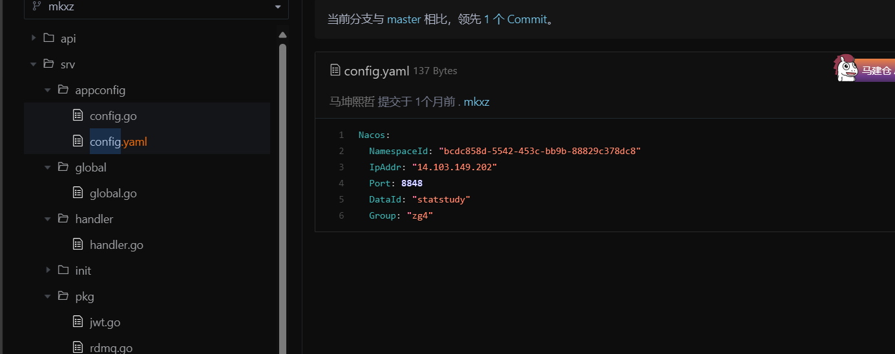
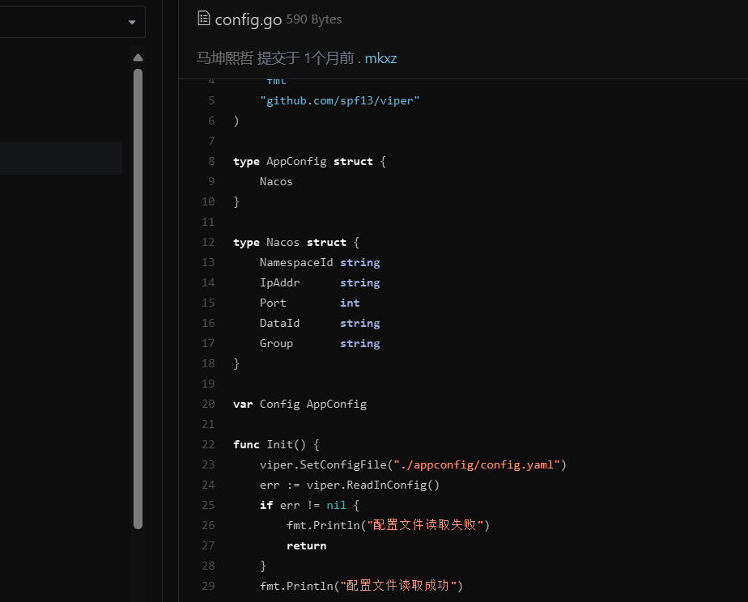

666
package appconfig

import (
"fmt"
"github.com/spf13/viper"
)

type AppConfig struct {
Nacos
}

type Nacos struct {
NamespaceId string
IpAddr      string
Port        int
DataId      string
Group       string
}

var Config AppConfig

func Init() {
viper.SetConfigFile("./appconfig/config.yaml")
err := viper.ReadInConfig()
if err != nil {
fmt.Println("配置文件读取失败")
return
}
fmt.Println("配置文件读取成功")

	err = viper.Unmarshal(&Config)
	if err != nil {
		fmt.Println("配置文件解析失败")
		return
	}
	fmt.Println("配置文件解析成功")
}

